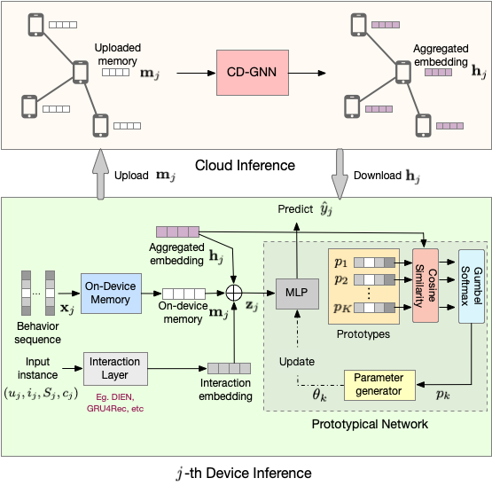
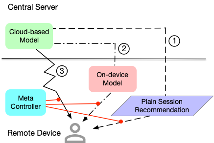

# Luoxi Edge-Cloud Collaboration Platform

The Luoxi platform (https://arxiv.org/abs/2111.06061) provides one-stop edge-cloud collaborative model training, inference, and deployment capabilities, and is committed to promoting the collaborative evolution of large and small models. The first version is mainly to provide our self-developed device-cloud collaboration models, including MobileM6, CIGAR, ECRec, MCRec, and PIN. In later versions, we will open-source the basic framework-level API, model checkpoints, etc.


## Project Architecture
- backend
  - dataset_hub: Provides a `BaseDataset` that subclasses `torch.utils.data.Dataset` to process data into samples and label, and implement classes specific to the particular models.
  - model_hub: Provides the CIGAR, ECRec, MCRec, and PIN models that subclass the `torch.nn.Module` class.
- scripts: Provides training and inference shell scripts specific to the particular model.
- train_hub: Provides functions to execute models. `train_hub/model_execution_template.py` is a template we provide that defines the training and inference process of a model by implementing the interface methods we provide

## Steps to Implement Your Own Model
1. Implement functions specific to your model (E.g. `model_provider` and `personalized_args_provider`) under `train_hub/`
2. Provide the Dataset class that subclasses BaseDataset in `backend/dataset_hub/base_datasets.py`
3. Provide the model class that subclasses the `torch.nn.Module` class.

## Requirements

* Python 3.6
* Pytorch 1.8
* scikit-learn 0.24
* Numpy 1.19
* onnx 1.11
* onnxruntime-gpu 1.10

## Models
### CIGAR
CIGAR is a GNN-based device-cloud collaborative recommendation framework to efficiently leverage cross-device information and achieve group-level model personalization. Specifically, we design the CD-GNN module to model the underlying relations among devices and enable real-time information exchange between devices during inference, followed by a Prototypical Network (PN) to generate a group of model parameters for group-level model personalization.



#### Data Preparation
The Alimama dataset is too large to upload in its entirety, so we upload a small portion of the processed dataset as an example. Please download the original dataset [here](https://tianchi.aliyun.com/dataset/dataDetail?dataId=56), and preprocess the data into the following format:

<escape>
<table style="undefined;table-layout: fixed; width: 1029px">
<colgroup>
<col style="width: 85px">
<col style="width: 130px">
<col style="width: 118px">
<col style="width: 54px">
<col style="width: 236px">
<col style="width: 174px">
<col style="width: 34px">
<col style="width: 83px">
<col style="width: 42px">
<col style="width: 73px">
</colgroup>
<thead>
  <tr>
    <th>Groups</th>
    <th>User ID</th>
    <th colspan="2">User feature</th>
    <th>User neighbors</th>
    <th colspan="2">User behavior sequence</th>
    <th colspan="2">Item feature </th>
    <th>Label</th>
  </tr>
</thead>
<tbody>
  <tr>
    <td>Feature</td>
    <td>userid</td>
    <td>cms_segid </td>
    <td>...</td>
    <td>neighbor_ids</td>
    <td>adgroup_id_seq</td>
    <td>...</td>
    <td>cate_id</td>
    <td>...</td>
    <td>label</td>
  </tr>
  <tr>
    <td>Example</td>
    <td>866481</td>
    <td>1</td>
    <td>...</td>
    <td>726921,832852,95848,726921,832852</td>
    <td>321835,305565,525386</td>
    <td>...</td>
    <td>382190</td>
    <td>...</td>
    <td>0</td>
  </tr>
</tbody>
</table>
</escape>

Every sample should follow this format with the features divided by ``\t``. Note that we can classify the features into 6 groups: _User ID_, _User feature_, _User neighbors_, _User behavior sequence_, _Item feature_, and _Label_. Among them, User ID, User feature, Item feature, and Label are just from original data. We get _User neighbors_ by computing graph-based similarity between users based on historical user-item interactions. We sort the clicks of each user by the timestamp to build the _User behavior sequence_, and the truncation length of user behaviors is 100. 
#### RUNNING
- Usage
```
optional arguments:
  --model                   Model name: PNN/CIGAR/CIGAR_WO_PN/CIGAR_WO_CDGNN
  --kv_dimension            Dimension of each feature field
  --mem_dimension           Dimension of memory
  --gnn_layers              Dimension of GNN layers
  --dim_hidden              Dimension of prediction layers
  --prototype_num           Number of prototypes
  --seq_length              Truncation length of user behaviors
  --user_fea_name           Name of each feature field in user feature
  --user_fea_col_id         Column ID of each feature field in user feature
  --item_fea_name           Name of each feature field in item feature
  --item_fea_col_id         Column ID of each feature field in item feature
  --seq_col_id              Column ID of each feature field in user behavior sequence feature
  --table_size              Embedding table sizes of each feature field, in the order 'userid, user feature and item featrue'
  --uid_graph_label_col_id  Column ID of userid, neighbors and label
  --onnx_step               Whether export to onnx format after training
  --onnx_export_path        Export path of onnx
```
- The example for CIGAR
```shell
git clone https://github.com/luoxi-model/luoxi_models.git
cd luoxi_models/
# Training
./scripts/cigar/cigar_training.sh
# Inference
./scripts/cigar/cigar_inference.sh
# onnx export
./scripts/cigar/cigar_export.sh
```
The model following had been supported: PNN, CIGAR_WO_PN, CIGAR_WO_CDGNN and CIGAR. Feel free to contact `fay.cyf@alibaba-inc.com` when you have any problems with CIGAR.

### ECRec
ECRec is a novel Click-Through Rate (CTR) prediction model based on 
an edge-cloud collaboration framework which trains the model on the
cloud servers and make the inference on the edge devices. Unlike conventional
CTR models, the networks structure and the input of inference are different
from those of training to adapt to the environment of the edge devices which usually
have limited computation power and storage space. Meanwhile, this asymmetric
framework can reduce the communication requirements and can make full use of
the instant sequence features on the edge devices. ECRec keeps a memory for
each user and works as follows. First, it trains the model on the servers with
long-term and short-term sequences. After training, it updates the memories which
record the historical information. Then it sends only part of the model to the 
edge devices to make CTR prediction. The model on the edge devices only takes
the instant sequences as the input to give CTR scores to the target items.

#### Data Preparation
The data format of ECRec is as follows.

| feature name | example | description |
----|----|----
|user_id|1|ID of the user|
|item_id|1|ID of the target item (keeps '0' free for padding)|
|cate_id|1|ID of the category of the target item (keeps '0' free for padding)|
|label|0|CTR label of this sample (0 or 1)|
|item_seq|1,2,3 ...|Long-term historical sequence of this user, divided by ','|
|cate_seq|1,2,3 ...|Category sequence of corresponding 'item_seq'|
|edge_item_seq|1,2,3 ...|Short-term historical sequence of this user, divided by ','|
|edge_cate_seq|1,2,3 ...|Category sequence of corresponding 'edge_item_seq'|
|seq_len|100|Length of 'item_seq'|

Every sample should follow this format with the features divided by ``\t``.

#### Usage
- Optional arguments
```angular2html
--num_item          Cardinal number of item vocabulary
--num_cat           Cardinal number of category vocabulary
--num_user          Cardinal number of user vocabulary
--num_head          Number of the heads
--d_model           Dimension of the embedding
--seq_length        Maximum length of the sequence
--drop_rate         Masking rate for training
--K                 Number of times to repeat the random mask
--tables            Input file(s) for training and evaluation
--infer_table       Input file for inference
--task_type         Task type, one of (training, inference, onnx_export)
--outputs           File to store the results of inference
--num-epochs        Number of training epochs
--batch-size        Batch size for training, evaluation and inference
--eval-interval     Interval steps between evaluations
--optimizer         Optimizer, one of (adam, adamW)
--load              Path to load the model for training and inference
--onnx_model_path   Path to store the ONNX model
--onnx_model_name   ONNX model name
--load_model_path   Path to load the model for ONNX model export
```
- Tasks

  - Training. One should set `--task-type=train` to train the model.
  The model will be evaluated after specific training steps. After model training,
    the memory will be updated, and then the model is ready for the inference on
    the edge devices. The shell script `scripts/ecrec/ecrec_training.sh` is an example
    to train with ECRec.
    
  - Inference. One should set `--task-type=inference` to make inference. The model
  will be loaded from the location specified by `--load`. The inference result will
    be exported to the path specified by `--infer`. The shell script `scripts/ecrec/ecrec_inference.sh` 
    is an example to make inference with ECRec.
    
  - Exporting ONNX model. One should set `--task-type=onnx_export` to export the
  ONNX model. To export the ONNX model, the mocked data should follow the order
    *user_id, item_id, cate_id, seq_len, label, edge_item_seq, edge_cate_seq, 
    item_seq, cate_seq*. To use the ONNX model, the latter two features, i.e.,
    *item_seq* and *cate_seq* can be omitted. The shell script `scripts/ecrec/ecrec_export.sh` 
    is an example to export ONNX model with ECRec.

Feel free to contact `yhanthu@gmail.com` when you have any problems with ECRec.


### MCRec
MCRec is a general framework which constructs a meta controller to dynamically 
manage the collaboration between the on-device model and the cloud-based model.
Unlike previous edge-cloud collaborative mechanism that builds a reranking model on
the device side to boost the performance of the cloud-based model, MCRec makes a hard
decision to choose one of them for serving. It dynamically senses user interests and 
utilizes a best canidate for serving by comprehensively understanding the cons and pros of each base 
models. Generally, in this framework, we need to do three steps: 1) train the base 
cloud-based model; 2) train the base on-device model; 3) train the meta controller. 
Regarding the core meta controller, authors need to construct a decision dataset which 
contains the user historical behavior and in this condition, which one model is a best choice. 
Note that, we can collect such a dataset by randomly probing online or we can construct a 
counterfactual dataset from the perspective of causal effect. For the latter, we can simply compare the 
predictibility of each model or compute the T-learner estimation regarding the following K exposure items based on the current historical 
features.



#### Model Type
In this exemplar framework, it refers to four types of models (Note that, CRec is shared in the session recommendation and re-fresh). 

| model name | description |
----|----
|CRec| the cloud-based model shared for the session recommendation (path 1 in above figure) and the real-time re-fresh (path 3 in above figure)|
|ORec| on-device model built on top of the CRec, which is for the fine-grained ranking with the on-device sequences|
|MCRec| a meta controller, which outputs one of three choices to decide the invoking choice among CRec (for the session recommenation), CRec (for the real-time refresh) and ORec|

#### Data Preparation
The data format of MCRec is as follows.

| feature name | example | description |
----|----|----
|hist_seq| 1,2,3,4,0,0,0... |historical clicked items (padding 0 if its length is smaller than 50 and pruning if its length is larger than 50)|
|cand|1 |ID of the candidate item for scoring|
|prior_score| 0.22 | the prior score from the agnostic cloud model in the scenario. This feature is only used by the on-device model i.e., ORec.|
|label|0|CTR label of this sample (0 or 1) if it is used in CRec and ORec. Or choice of this sample (0 or 1 or 2) if it is used by the meta controler.|

Every sample should follow this format with the features divided by ``\t``.

#### Usage
- Optional arguments
```angular2html
--dim               Dim of the item embedding
--num               Number of items
--tables            Input file(s) for training and evaluation
--task_type         Task type, one of (training, inference, onnx_export)
--outputs           File to save the results of inference
--num-epochs        Number of training epochs
--batch-size        Batch size for training, evaluation and inference
--eval-interval     Interval steps between evaluations
--optimizer         Optimizer, one of (adam, adamW)
--load              Path to load the model for training and inference
--onnx_model_path   Path to save the ONNX model
```
- Tasks

  - Training. One should set `--task-type=train` (by default) to train the model.
  The model will be evaluated regarding the loss of the test set after specific 
  training steps. After the training phase, the model will be saved for inference.
    
  - Inference. One should set `--task-type=inference` to make inference. The model
  will be loaded from the location specified by `--load`. The inference result will
  be exported to the path specified by `--outputs`.
    
  - Exporting ONNX model. One should set `--task-type=onnx_export` to export the
  ONNX model to the path specified by`--onnx_export_path`. To export the ONNX model, the mocked data should follow the order
   *hist_seq, label*. Note that, only the models that will be deployed on the device
   side need to be exported as the onnx model (we give an example on the ORec, and the 
   MCRec can be done similarly).
    
The shell scripts `scripts/mcrec/mcrec_training.sh`, `scripts/mcrec/mcrec_inference.sh` and
`scripts/mcrec/mcrec_export.sh` show the examples of the training, inference and export. Note that, for inference and export, 
the user need to align the `time` suffix generated in the training phase (see the shell scripts).


Feel free to contact `jiangchao.yjc@alibaba-inc.com` when you have any questions on MCRec.


### GGCN


GGCN is a General Graph Neural Network based on an edge-cloud collaboration framework, 
which trains the model on the cloud servers and make the inference on the edge devices. 
Unlike conventional GNN models, the networks structure and the input of inference are 
different from those of training to adapt to the environment of the edge devices which 
usually have limited computation power and storage space. 
Meanwhile, this framework can learn robust GNN model and achieve better performance 
while existing distribution shift between training data and testing data. 


#### Datasets


Please download the  [dataset](http://snap.stanford.edu/graphsage/), and preprocess the data into the following format:

* <train_prefix>-G.json -- A networkx-specified json file describing the input graph. Nodes have 'val' and 'test' attributes specifying if they are a part of the validation and test sets, respectively.
* <train_prefix>-id_map.json -- A json-stored dictionary mapping the graph node ids to consecutive integers.
* <train_prefix>-class_map.json -- A json-stored dictionary mapping the graph node ids to classes.
* <train_prefix>-feats.npy [optional] --- A numpy-stored array of node features; ordering given by id_map.json. Can be omitted and only identity features will be used.
* <train_prefix>-walks.txt [optional] --- A text file specifying random walk co-occurrences (one pair per line) 

#### Usage


```
optional arguments:
  --kv_dimension            Dimension of each feature field
  --gnn_layers              Dimension of GNN layers
  --dim_hidden              Dimension of prediction layers
  --table_size              Embedding table sizes of each feature field, in the order 'userid, user feature and item featrue'
  --task_type               Task type, one of (training, inference, onnx_export)
  --outputs                 File to store the results of inference
  --num-epochs              Number of training epochs
  --batch-size              Batch size for training, evaluation and inference
  --eval-interval           Interval steps between evaluations
  --optimizer               Optimizer, one of (adam, adamW)
  --load                    Path to load the model for training and inference
  --onnx_model_path         Path to store the ONNX model
  --onnx_step               Whether export to onnx format after training
  --onnx_export_path        Export path of onnx
```
- The example for GGCN
```shell
git clone https://github.com/luoxi-model/luoxi_models.git
cd luoxi_models/
# Training
./scripts/GGCN/ggcn_training.sh
# Inference
./scripts/GGCN/ggcn_inference.sh
# Exporting ONNX model. 
./scripts/GGCN/ggcn_export.sh
```

Feel free to contact `chencsmat@gmail.com` when you have any problems with GGCN.

### PINRec


PINRec is a general framework for solving the long tail problem in the device-cloud scenario. It is suitable for various recommendation models such as DIN, SASRec, GRU4Rec, etc. It can make the model have both common knowledge and individual knowledge, so as to improve the performance of the model on the tail user group without reducing the performance of the model on the head user group.
Generally speaking, in this framework, we need to do 2 steps:
1) Use all data for training on the cloud side, and obtain a trunk network that can extract common knowledge through gradient aggregation, and send it to each device;
2) Insert the plugin network on the terminal into the trunk network delivered by the cloud side. Each plugin network is trained using only the data of this user group, thereby extracting personality knowledge. The trunk network is still updated on the cloud side similar to 1), so as to ensure that the trunk network on the cloud side and the plugin network on the device side are adapted in real time.

During inference, the plugin network on the terminal side is added to the trunk network issued from the cloud to realize the integration of common knowledge reasoning and individual knowledge reasoning.


#### Data Preparation
Please download [Movielens](http://grouplens.org/datasets/movielens/), [Amazon](http://jmcauley.ucsd.edu/data/amazon/) or other datasets, and then prepare the data in the following format:

| feature name  | example | description                                                |
---------------|----|------------------------------------------------------------
| user_id       |1| ID of the user                                             |
| target_id     |1| ID of the target item (keeps '0' free for padding)         |
| clk_sequence  |1,2,3 ...| Long-term historical sequence of this user, divided by ',' |
| label         |0| CTR label of this sample (0 or 1)                          |
| group_id      |0| Group ID divided by user activity                          |

Every sample should follow this format with the features divided by ``;``.


#### Usage


```
optional arguments:
  --model                   Model type
  --group_num               Number of user groups
  --arch_config_path        Path of model configs
  --arch_config             Base64-encoded model configs
  --stage_switch_epoch      Number of training epochs (stage1)
  --optimizer_runtime       Store the optimizer so that it can be adjusted at stage2
  --task_type               Task type, one of (training, inference, onnx_export)
  --outputs                 File to store the results of inference
  --num-epochs              Number of training epochs
  --batch-size              Batch size for training, evaluation and inference
  --eval-interval           Interval steps between evaluations
  --optimizer               Optimizer, one of (adam, adamW)
  --load                    Path to load the model for training and inference
  --load_model_path         Path to load the specific model for training and inference
  --onnx_model_path         Path to store the ONNX model
  --onnx_export_path        Export path of onnx
```
- The example for PINRec
```shell
git clone https://github.com/luoxi-model/luoxi_models.git
cd luoxi_models/
# Training
./scripts/pinrec/pinrec_training.sh
# Inference
./scripts/pinrec/pinrec_inference.sh
# Exporting ONNX model. 
./scripts/pinrec/pinrec_export.sh
```

Feel free to contact `zheqilv@zju.edu.cn` when you have any problems with PINRec.
